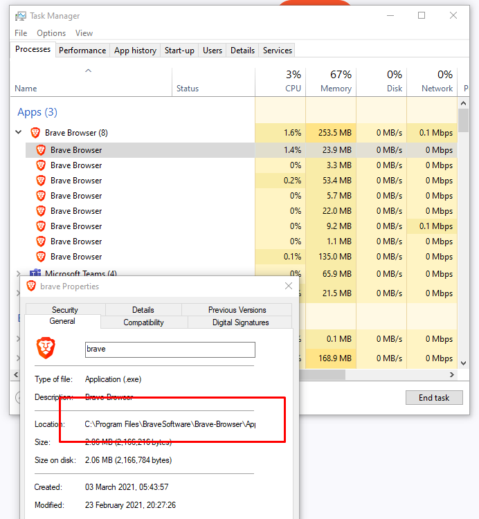

<!-- README.md is generated from README.Rmd. Please edit that file -->

# popdata 

`popdata` is an R client for the [UNHCR POPDATA
platform](https://popdata.unhcr.org).

## Introduction

The [UNHCR POPDATA platform](https://popdata.unhcr.org) is UNHCR
internal platform for population statistics.

## Installation

This package is not on yet on CRAN and to install it, you will need the
[`remotes`](https://github.com/r-lib/remotes) package. You can get
`popdata` from Gitlab or Github (mirror)

``` r
## install.packages("remotes")
remotes::install_gitlab("dickoa/popdata")
```

## Using the popdata package

``` r
library("popdata")
```

`popdata` uses the `chromote` package to log into the POPDATA platform
and generate all the tokens and cookies needed to connect into the
platform. The package`chromote` uses `chrome` as the default browser and
if you plan to use `chrome` you can skip what will follow and go
directly to the second point (log into the platform).

All `chromium` based browsers such as `chromium`, `microsoft edge`,
`brave`, `opera`, `vivaldi`, etc. can be used but you need to tell
`chromote` where to find them.

You can specify which browser to use by setting the `CHROMOTE_CHROME`
environment variable to the path of the executable of your browser. The
`Sys.which` function in `R` can be used on Unix system to get the path.

On Linux, to have the path to the `brave` browser executable, we can use
the following command:

``` r
Sys.which("brave")
##            brave
## "/usr/bin/brave"

Sys.setenv("CHROMOTE_CHROME" = "/usr/bin/brave")
```

On Windows, to have the path to `brave` executable, you can use the task
manager to check the path.



``` r
Sys.setenv("CHROMOTE_CHROME" = "C:\\Program Files\\BraveSoftware\\Brave-Browser\\Application/brave.exe")
```

On Windows, if you can download or already have `chrome` installed, it’s
much easier to use it since no setup is required (i.e no environment to
set).

When you set your environment `Sys.setenv`, you will need to do it each
time you restart `R`. One way to have it stored permanently is to use
your `.Renviron` file and add the following entry:

``` r
CHROMOTE_CHROME="/usr/bin/brave"
## or
CHROMOTE_CHROME="C:\\Program Files\\BraveSoftware\\Brave-Browser\\Application/brave.exe"
```

The easiest way to add an entry to `.Renviron`, is to use the `usethis`
package access and use `usethis::edit_r_environ()`.

### Log into POPDATA

Now that `chromote` can access a web browser (preferably `chrome`), you
can use `pd_login` to log and store the login cookie in the package
cache (`$HOME/.cache/R/popdata` in Unix based distribution).

``` r
pd_login()

## Check that a file was stored
pd_cache_list()
## [1] "popdata_azure_cookies.rds"
```

As long as you keep this `rds` file in the package cache and as long as
you don’t change your POPDATA username and password, you can keep this
file to interact with `popdata`, no need to re-log using `pd_login`.

### Read data directly from POPDATA

Once logged-in, you can the `popdata` function or one of its wrapper
`pd_asr`, `pd_mysr` or `pd_pf` to get the data you need from POPDATA. In
the first run, it will generate a session cookie that will need be
updated if you inactive for a long period of time (approx. 30 min).

``` r
pd_asr(table = "refugees", year = 2019)
## No valid popdata session available, generating a session cookie...
## # A tibble: 6,214 x 30
##    asylum origin yearStartTotal yearStartTotalU… groupRecognition
##    <chr>  <chr>           <dbl>            <dbl>            <dbl>
##  1 AFG    IRN                34               34                0
##  2 AFG    IRQ                 1                1                0
##  3 AFG    PAK             72194            72194                0
##  4 ALB    ARE                 3                3                0
##  5 ALB    BUL                 1                1                0
##  6 ALB    CHI                12               12                0
##  7 ALB    COD                 3                3                0
##  8 ALB    FGU                 0                0                0
##  9 ALB    GAZ                14               14                0
## 10 ALB    IND                 0                0                0
## # … with 6,204 more rows, and 25 more variables:
## #   temporaryProtection <dbl>, individualRecognition <dbl>,
## #   resettlementArrivals <dbl>, births <dbl>,
## #   increasesOther <dbl>, increasesTotal <dbl>,
## #   decreasesVoluntaryRepatriationTotal <dbl>,
## #   decreasesVoluntaryRepatriationTotalUnhcrAssisted <dbl>,
## #   decreasesResettlementTotal <dbl>,
## #   decreasesResettlementTotalUnhcrAssisted <dbl>,
## #   cessation <dbl>, naturalization <dbl>, deaths <dbl>,
## #   decreasesOther <dbl>, decreasesTotal <dbl>,
## #   yearEndTotal <dbl>, yearEndUASCTotal <dbl>,
## #   yearEndUASC_0_4 <dbl>, yearEndUASC_5_11 <dbl>,
## #   yearEndUASC_12_14 <dbl>, yearEndUASC_0_14_total <dbl>,
## #   yearEndUASC_15_17 <dbl>, yearEndTotalUnhcrAssisted <dbl>,
## #   source <chr>, basis <chr>
```

You can use `options(popdata_quiet = FALSE)` to remove the message or
use the `quiet` argument in any of `popdata`, `pd_asr`, `pd_mysr` or
`pd_pf`.

``` r
ref <- pd_asr(table = "refugees", year = 2019, quiet = TRUE)
```

## Meta

-   Please [report any issues or
    bugs](https://gitlab.com/dickoa/popdata/issues).
-   License: MIT
-   Please note that this project is released with a [Contributor Code
    of Conduct](CONDUCT.md). By participating in this project you agree
    to abide by its terms.
